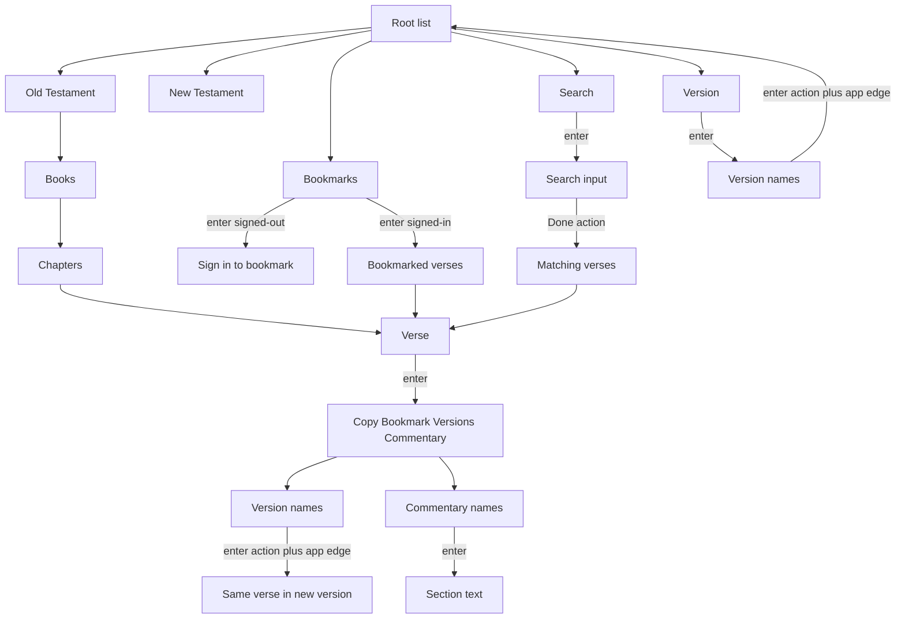

# Bible versions, search, bookmarks, and commentaries

Implementation plan for the next agent. Corpus catalog: [`src/apps/bible/data/SOURCES.md`](../src/apps/bible/data/SOURCES.md). Binding design: [`../AGENTS.md`](../AGENTS.md) **Long-horizon design**, [`ENGINEERING.md`](ENGINEERING.md).

**Scope lock:** only these seven works:

| Id | Work | Role | Import from |
|----|------|------|-------------|
| `kjv` | King James Version (1769) | Bible | `raw/bibles/kjv_vpl/eng-kjv2006_vpl.txt` |
| `asv` | American Standard Version (1901) | Bible | `raw/bibles/asv_vpl/eng-asv_vpl.txt` |
| `bbe` | Bible in Basic English | Bible | `raw/bibles/bbe_vpl/engBBE_vpl.txt` |
| `ylt` | Young’s Literal Translation (1898) | Bible | `raw/bibles/ylt_vpl/engylt_vpl.txt` |
| `tsk` | Treasury of Scripture Knowledge | Commentary | `raw/commentaries/tsk/tskxref.txt` |
| `henry` | Matthew Henry (complete) | Commentary (ranges) | `raw/commentaries/matthew-henry/{BOOK}/{n}.json` |
| `jfb` | Jamieson, Fausset and Brown | Commentary | `raw/commentaries/jamieson-fausset-brown/{BOOK}/{n}.json` |

Do **not** add WEB, ESV, or any extra commentary. ESV is copyrighted (Crossway). e-Sword `.bblx` / `.cmtx` files were **deleted** — do not re-add or decrypt them.

**Design rule (binding):** catalogs and sequence objects, not `if (id === "kjv")` branches.

**Bookmarks:** signed-out users get a **sign-in node** (Notes / `signedOut()` pattern). Never `sessionId` ownership.

**Input accessible name:** out of this slice. Deferred in ENGINEERING / ARCHITECTURE Display. Search ships with Display’s generic `"Input"` name.

---

## Corpus (already on disk)

Raw **import** files are committed under `src/apps/bible/data/raw/` (VPL `*_vpl.txt`, HelloAO chapter JSON, `tsk/tskxref.txt`). Zips, USFM, and SWORD backups stay gitignored. Re-fetch backups: `node scripts/download-bible-sources.mjs`. Paths and licenses: [`SOURCES.md`](../src/apps/bible/data/SOURCES.md).

**Bibles:** eBible VPL — one line `BOOK CHAPTER:VERSE text`, 31,102 verses each. KJV supplied words are `[was]`, `[it was]`; **keep the words**, strip brackets only. Do not extend [`scripts/prepare-kjv.mjs`](../scripts/prepare-kjv.mjs) `{...}` stripping (that is why current `kjv.json` drops words). USFM zips are tagged originals, not the import format.

**Henry / JFB:** HelloAO chapter JSON. `content[]` keyed by **starting verse**; range = until next entry. Matches the old e-Sword range columns (schema hint only). Henry includes Song of Solomon (`raw/commentaries/matthew-henry/SNG/1.json`–`8.json`), filled from the LyteWord CC0 dump into the same JSON shape.

**TSK:** prefer `tskxref.txt` (tab: book key, chapter, verse, sort, phrase, reference list). Store refs as `commentary_xrefs`; flatten into the section label for this slice. SWORD zips are backups only.

**Importer the executing agent should build:**

1. Parse VPL + HelloAO JSON + `tskxref.txt` into SQLite via idempotent `ensureCatalog(db)`.
2. Map books via USFM / `CanonBook` aliases, not filename guesses.
3. Tests: tiny hand-written fixtures (a few verses, one ranged commentary covering 1–8). Never load full corpora in unit tests.
4. Import sources under `raw/` that the importer reads may be committed so production can seed without a download step. Do not commit zips, USFM, or SWORD backups. Do not extend brace-stripping `kjv.json`.

---

## Design: catalogs and sequences

New [`src/apps/bible/catalog.ts`](../src/apps/bible/catalog.ts) plus DB rows. Graph builders interpret records; they do not name works.

- `CanonBook` — USFM id (`GEN`, `MAT`), sort, testament **string**, default label, aliases (URL names).
- `VersionRecord` — `id`, `label`, `sortOrder`, `license: "public-domain"` (seam for `"licensed"` later; unused now).
- `CommentaryRecord` — `id`, `label`, `sortOrder`.
- `RootItem[]` — `{ type: "testament", testament } | { type: "bookmarks" } | { type: "search" } | { type: "versions" }`.
- `VerseOption[]` — `{ type: "copy" | "bookmark" | "versions" | "commentary" }`.

**Verse sequences** — one verse renderer, three sibling policies:

```ts
type VerseSequence =
  | { type: "chapter"; versionId: string; bookId: string; chapter: number }
  | { type: "bookmarks" }
  | { type: "search"; queryId: string };
```

Sequence owns sibling ids, wrap vs dead-end, label shape (chapter = `N. text`; bookmarks/search = `Matthew 5:3. text`). Context options are the same for every sequence. Encode sequence in the node id (`bible:v:…` / `bible:bm:…` / `bible:q:{queryId}:…`). Canonical ref is shared by option nodes.

**Active version:** signed-in → `reader_prefs` keyed by `userId`. Signed-out → URL if present, else default `kjv`. No session-pref table. Reading URLs still include version (`/asv/Matthew/5/8`). Bookmark/search **display** uses active version; bookmark **key** is canon ref without version.

---

## Navigation



**Root Version:** enter pushes the version list. Enter on a version: `action: true` plus same-app `kind: "app"` edge to `{ appId: "bible", path: "/{versionId}" }` (resets stack, lands on OT). Action writes prefs only when `ctx.userId` is set.

**Verse Versions:** same action + `app` edge to `/{versionId}/{book}/{chapter}/{verse}`. Missing verse: clamp to last verse of that chapter.

**Search:** enter Search pushes an input. Done: `action` + `passInputText`. Cancel pops to Search heading. Results replace the input. Tokenize non-letters, case-insensitive, **AND of all tokens**, whole words, canon order, cap as `SearchPolicy`. Empty/no hits: a text node.

**Bookmarks:** if `!ctx.userId`, enter Bookmarks (and enter verse-menu Bookmark) → sign-in node; `enter` → Account; `back` pops or Home as appropriate (copy Notes). If signed in: enter Bookmarks → first bookmark or “No bookmarks yet.” Prev/next among bookmarks, no wrap. Verse-menu Bookmark toggles; status “Bookmarked” / “Bookmark removed”; option label “Bookmark” / “Remove bookmark”. Owner = `userId` only. No owner ids in node ids or URLs.

**Commentary:** catalog list of the three works. Enter one → the **most specific** section whose inclusive range covers this verse. Text only. Xrefs flattened into the label.

---

## Schema

Do not keep using per-verse `commentary_notes` + `version_id`. Commentaries are version-independent. Add [`002_reader.sql`](../src/apps/bible/db/migrations/002_reader.sql) (never edit `001`). In development, 002 may drop unused placeholders (`bookmarks.owner_kind`, session bookmarks, per-verse `commentary_notes`); no dual-write. Product is in development — no migration to preserve existing rows.

- `canon_books`, `books` (per version, FK canon id + display name)
- `verses` `(version_id, book_id, chapter, verse)`
- `verse_words` inverted index (Node 22 `node:sqlite` has no reliable FTS5)
- `reader_prefs` `(user_id → active_version_id)` — no session owner
- `bookmarks` `(user_id, book_id, chapter, verse)` unique, **no version**
- `commentaries`, `commentary_sections` (`start_ord`, `end_ord`, `body`), `commentary_coverage`, `commentary_xrefs`
- `search_queries` session-scoped id + query string; re-run AND on refresh

`verse_ord` = book sort × 1e6 + chapter × 1e3 + verse.

---

## Modules

Split [`view.ts`](../src/apps/bible/view.ts). Do not pile into the 600-line switch.

| Module | Role |
|--------|------|
| [`ids.ts`](../src/apps/bible/ids.ts) | All node ids including sequence prefixes |
| `catalog.ts` | Root items, verse options, version/commentary descriptors |
| [`types.ts`](../src/apps/bible/types.ts) | `BibleRef` uses `bookId`; store methods for prefs/bookmarks/search/commentary |
| [`store.ts`](../src/apps/bible/store.ts) | SQLite only |
| `search.ts` | Tokenize + AND on `verse_words` |
| `view/*` | Dispatch + root, reading, verse, versions, bookmarks, search, commentary |
| [`index.ts`](../src/apps/bible/index.ts) | Pass `ctx` (today Bible ignores `userId`) |

Copy line includes version label. Still `clipboardText` on the action refresh only.

**Not in core:** versions, search policy, commentary ranges, bookmark ownership, Bible paths, `inputName`.

---

## Deliberately not blocked

- Licensed translations: `license` on `VersionRecord`
- More works: catalog row + seed (only if the owner adds a module later)
- Commentary verse links: `commentary_xrefs` already stored
- Extra testaments: testament is a string on `CanonBook`
- Search scope / phrases: tokenizer stays a function; queries can gain JSON later
- Bookmark folders: unique key is verse ref
- Parallel versions: node ids already include version
- Book/chapter commentary tables: same commentary catalog, later sequences

---

## Tests

[`tests/bible.test.ts`](../tests/bible.test.ts): root includes Version; version action → OT and later verse text; verse-context version switch; signed-out bookmarks → sign-in; signed-in toggle + list; search AND / empty / cap; commentary range shared by verses 1–8; copy includes version; no `navigator.clipboard`. Fake `ctx` with/without `userId`.

Browser: version round-trips, search, bookmarks (out and in), commentary on a ranged passage.
