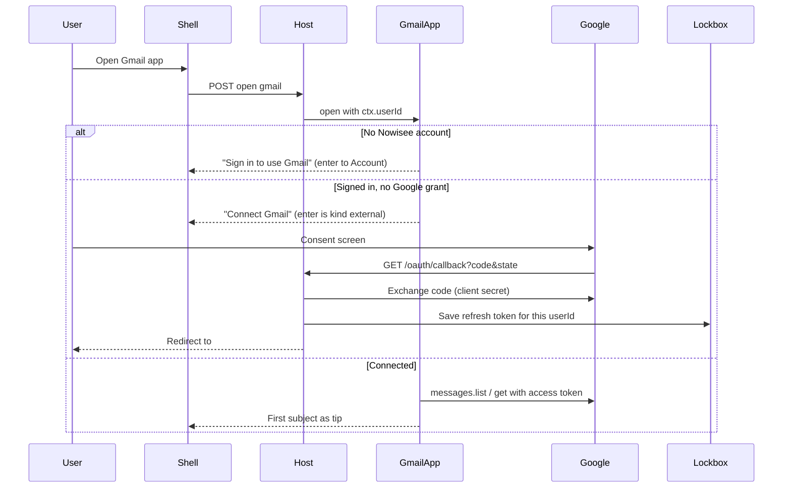

# Nowisee — Gmail app

**Status:** v1 **landed** (August 2026). Inbox subjects, body chunks, compose/send, connect/disconnect. No reply/forward. Uses the host lockbox and generic OAuth broker ([`IDENTITY.md`](IDENTITY.md) §3). Product locks: [`SPEC.md`](SPEC.md).

**v1 graph:** signed-out → Connect Gmail (`kind: "external"`) → inbox subjects (open lands on the first). Up from the first subject is Compose; Up from Compose is Disconnect. Enter a subject to read body chunks (`back` pops). Compose is To → Subject → Body → Sent in place. No teleport to inbox. No Reply/Forward.

Code: [`src/apps/gmail/`](../src/apps/gmail/). Tokens: `ctx.oauth` only (never `gmail.db`, never a `RefreshResult`). Env: `NOWISEE_LOCKBOX_KEY`, `NOWISEE_OAUTH_GMAIL_CLIENT_ID`, `NOWISEE_OAUTH_GMAIL_CLIENT_SECRET`, `NOWISEE_ORIGIN` (OAuth redirect `{origin}/oauth/callback`).

The rest of this file is the feasibility research that led to that slice.

---

# Feasibility notes (research)

**Verdict:** Talking to Gmail from Nowisee will work. The product already assumed this: apps run on the server, the browser never calls Google, tokens live in the host lockbox, and signed-out (or unconnected) is an ordinary node — see [`IDENTITY.md`](IDENTITY.md) §2–3 and [`PREPAREDNESS.md`](PREPAREDNESS.md) “Real mail”. Nothing in core needs a Gmail special case.

What is *not* free or automatic is **Google’s OAuth program**: reading mail requires **restricted** scopes, which caps you at 100 test users until you complete verification (and a security assessment if you store mail on the server — which we must, because tokens and message bodies never belong in the page).

This plan consumes the host **lockbox** and **OAuth broker** ([`IDENTITY.md`](IDENTITY.md) §3). Distinguish two secret kinds; they are different slots:

| Secret | What it is | Who it belongs to |
|--------|------------|-------------------|
| Google **client id + client secret** | The “app key” from Google Cloud | One pair for the whole Gmail app; host secrets, never the page |
| Per-user **refresh token** | Proof that *this* Nowisee user connected *this* Google account | Lockbox keyed `(userId, appId, slot)` |

---

## 1. How you get the Google “app key”

There is no Gmail API key that can read someone’s inbox. User mail is **OAuth 2.0**. The credentials you create are an **OAuth client ID** (public) and **client secret** (confidential). A Google Cloud **API key** cannot do this job.

### Console steps (do once per environment)

1. In [Google Cloud Console](https://console.cloud.google.com/) create a project (e.g. `nowisee-gmail-dev`). Keep a **separate** project for production; Google recommends that and verification is per project.
2. Enable **Gmail API** (APIs & Services → Library).
3. Configure the **OAuth consent screen**:
   - User type **External** (unless you only serve one Google Workspace org — then **Internal** and verification is skipped).
   - App name, support email, developer contact.
   - For testing you can skip homepage / privacy policy. For a public launch Google requires a public homepage and a privacy policy on the same domain that states you read/send mail, what you store, and that you delete on disconnect.
4. Add scopes (see §3). They will show as **Restricted** for read/modify.
5. **Audience → Testing**, add up to **100 test Google accounts**. Only those accounts can connect. They will see a “Google hasn’t verified this app” screen; they click Advanced → Go to Nowisee.
6. Credentials → **Create credentials → OAuth client ID → Web application** (not Desktop, not API key, not service account).
   - Authorized JavaScript origins: `http://localhost:5173` (dev), later `https://your-origin`.
   - Authorized redirect URIs: a **real HTTP path**, not a hash. The host callback is **`GET /oauth/callback`** for every app (dispatch by `state`). Example: `http://localhost:5173/oauth/callback` and later `https://your-origin/oauth/callback`.
7. Copy client ID + secret into the host secrets store (or env, see options below). Never commit them. Never send them to the client bundle.

**Service accounts cannot open consumer Gmail.** Domain-wide delegation is Workspace-admin only. Ignore that path.

**Localhost is allowed** as a redirect URI without domain verification. Production needs HTTPS and a verified domain.

---

## 2. Two logins, not one

Nowisee identity and Google identity stay separate ([`IDENTITY.md`](IDENTITY.md) §2). Core still knows nothing about “signed in.”



**Required order:** Nowisee session first (`ctx.userId`), then Google connect. The lockbox cannot store a token against `null`. Reuse the existing `signedOut()` helper from [`src/app-kit/signedOut.ts`](../src/app-kit/signedOut.ts) for the Nowisee-signed-out case. The “Connect Gmail” node is a **different** node: enter is `kind: "external"` to Google’s authorize URL, not an `app` edge to Account.

Navigator already leaves the product on `kind: "external"` ([`src/core/navigator.ts`](../src/core/navigator.ts)). That is the correct way to send someone to Google. Apps still must not build `#/…` URLs.

### OAuth callback is the one new host HTTP surface

Google redirects with **GET + query string**. `/api` stays POST + JSON + Origin. The OAuth callback is a **separate** GET: `GET /oauth/callback`. CSRF for this GET is the OAuth `state` nonce (bound to `sessionId` + `userId` in `oauth_states`, 10-minute TTL), not the JSON Origin check. Do **not** run `checkCsrf` on this GET.

The session cookie is `SameSite=Lax`, so it **is** sent on this top-level GET. That is what lets the host know which Nowisee user just returned.

After exchanging the code, the host stores the refresh token in the lockbox and **302-redirects** to the SPA hash (e.g. `/#/gmail`). Then `open` runs as usual and the inbox is the tip.

**Option A (landed): generic host OAuth broker.** Host owns `GET /oauth/callback` (one path for every app; dispatch by `state`). Gmail (and later any OAuth app) is granted `ctx.oauth` / uses host env for that app’s client id/secret. The host does not parse Gmail messages. This matches “host owns HTTP; apps own domain.” Do not add `/oauth/gmail/callback`.

**Option B: Gmail-specific route in the host.** Faster to ship, worse: the host grows a product name. Avoid unless you explicitly want a one-off.

**Option C: OAuth 2 device code grant.** Stay inside Nowisee: show “Go to google.com/device and enter ABCD-EFGH.” No redirect URI. Google may not enable device flow for a Web client; confirm before betting on it. Better as an *accessibility extra* than as the only path.

Always request `access_type=offline` and `prompt=consent` on first connect so Google actually returns a **refresh token**. Store it immediately; Google often sends it only once.

**Testing gotcha:** while the consent screen is in **Testing**, Google refresh tokens **expire after 7 days**. Reconnect weekly until the app is published/verified.

---

## 3. Scopes (this is the main feasibility gate)

From Google’s current Gmail scope table:

- `gmail.send` — **Sensitive** only (send, cannot read inbox).
- `gmail.readonly`, `gmail.compose`, `gmail.modify`, `mail.google.com` — **Restricted**.

An inbox you can read **requires a restricted scope**. There is no non-restricted way to fetch subjects/bodies.

**Option 1 — least privilege for a first slice:** `gmail.readonly` + `gmail.send`. Read inbox + send/reply. Cannot mark read, archive, or trash.

**Option 2 — one scope that matches a real mail client:** `gmail.modify` only. Read, send, labels, trash (not skip-trash permanent delete). Simplest to request; still restricted.

**Option 3 — `mail.google.com`:** IMAP-level, including permanent delete. Triggers the heaviest review. Do not start here.

Do **not** use IMAP/SMTP + app passwords. App passwords are a worse a11y flow, and IMAP still wants the most restricted scope if you use XOAUTH2.

### Who can use it, and what verification costs

| Audience | What Google requires | Cost / time |
|----------|----------------------|-------------|
| You + named testers (≤100 Google accounts) | Testing audience, no verification | **$0**. Unverified-app warning. 7-day refresh tokens. |
| Internal Google Workspace only | User type Internal | **$0**, no restricted-scope review. |
| Any Gmail user, public | Brand verification + restricted-scope review. Because the **server** holds tokens and mail: **annual CASA / App Defense Alliance security assessment**. Also: homepage, privacy policy, unlisted demo video of the OAuth + inbox flow, Search Console domain verify. | Google brand review: free, days. Restricted review: weeks. CASA: **paid, billed by a Google-empanelled lab** (third-party quotes currently range from roughly hundreds/year on self-serve CASA tracks to much more on legacy manual tracks — **confirm with the lab at submission**; do not budget from blog posts). Recertify **every 12 months**. |
| Stay under 100 forever | Personal-use exception | **$0**, but you cannot onboard strangers. |

Gmail restricted scopes are only allowed for certain app types (email client, backup, etc.). An accessibility mail reader/composer is an email client; say that in the justification. You must also follow Google’s **Limited Use** rules: no ads from mail content, no selling the data, delete user data on disconnect/account deletion.

**Option for skipping Google verification entirely:** a paid aggregator (Nylas, Unipile, etc.). They already have verified Gmail apps; you pay **per connected mailbox / month**. Makes sense only if public launch + CASA is the blocker. You would still talk to *their* API from the Gmail app server, never from the browser.

---

## 4. Talking to Gmail — will it work, and what does it cost?

**Yes.** The Gmail REST API is the right backend. The app (server) calls `https://gmail.googleapis.com/gmail/v1/users/me/...` with a Bearer access token minted from the lockbox refresh token.

Keep **zero runtime npm dependencies** for the HTTP client: use Node `fetch`, not `googleapis`. Parse JSON. This matches the rest of the repo ([`package.json`](../package.json)).

Suggested first calls:

- `users.getProfile` — email address for “Connected as …”.
- `users.messages.list?labelIds=INBOX&maxResults=20` — ids (5 quota units).
- `users.messages.get?format=metadata&metadataHeaders=From,Subject,Date` — subject lines (20 units each).
- `users.messages.get?format=full` — body when the user enters a message (20 units).
- `users.messages.send` — send (100 units).
- Later: `users.history.list` (2 units) using a stored `historyId` so you do not re-download the mailbox every Down key.

**Quota (current Google docs):**

- 1,200,000 units/min/project; **6,000 units/min/user**.
- Daily “no extra charge” threshold: **80,000,000 units/project**. Google has said usage **under** that stays free; exceeding it is **planned to bill later in 2026** with ≥90 days notice. Interactive use for a small user base will not approach this.
- Backoff on 429. Do not retry action sends blindly (locked: core never retries `extras.action`; the app should not either).
- Separate **sending** caps (Gmail product, not API units): **500/day** consumer, **2000/day** Workspace.

**Google Cloud bill:** Gmail API calls themselves are **$0** at normal volume. A Cloud project is free. You do **not** need a billing account just to enable Gmail API. **Pub/Sub** (only if you add push `users.watch`) has a free tier, then small charges; skip it for v1.

**Nowisee cost:** same Node host you already run. Extra SQLite file `data/apps/gmail.db` for cache + short-lived OAuth `state` (not tokens). Bandwidth is Gmail JSON, not huge.

---

## 5. Architecture fit (do not put Gmail in core)

Mirror Notes:

| Piece | Where |
|-------|--------|
| `AppModule` id `"gmail"`, label `"Gmail"` | [`src/apps/gmail/`](../src/apps/gmail/) |
| Graph / wording | `view.ts` — no SQLite import |
| Gmail REST + MIME parse + token refresh | `gmailClient.ts` (test with a fake fetch) |
| Cache, oauth state, last `historyId` | `store.ts` + `data/apps/gmail.db` |
| Tokens | `ctx.lockbox` only |
| Client id/secret | Host secrets for this app id |
| Register | [`server/host.ts`](../server/host.ts) `startGmailApp`, [`src/shell/bootstrap.ts`](../src/shell/bootstrap.ts) remote stub |
| Help catalog | Home already lists whatever is registered |

**Owner in every Gmail query:** treat Google message ids on the stack as untrusted. Always: this `userId`’s lockbox slot → that user’s token → `users/me`. Never “fetch message X” without going through the connected account. Same rule as Notes ([`IDENTITY.md`](IDENTITY.md) §9).

**Do not** put SMTP in core, a `GmailRepository` in core, or a 401/redirect in the shell.

**1 MiB `/api` cap:** never put a whole HTML MIME blob in `warm`. Subjects + a neighborhood of body chunks only.

**`requestRefresh`:** [`PREPAREDNESS.md`](PREPAREDNESS.md) says implement it before mail so new mail can update the current tip in place. **Option:** ship v1 without it (new mail appears on the next intent / revalidation). **Option:** implement the reserved platform capability first (small core change, generic). Recommend the second before a public mail app; not required to prove Gmail talks.

---

## 6. App graph (sketch only — not the design focus)

Same pattern as Notes ([`src/apps/notes/view.ts`](../src/apps/notes/view.ts)): create **above** the list (`prev` from the first item), default tip = first real item.

```text
Compose                    (prev from first subject; no further prev)
  --next-->  Subject 1     (open lands here)
  --next-->  Subject 2
  --next-->  …             (last next omitted, or a "More" node that loads the next page)

Subject N
  --enter-->  Body chunk 1
               --next--> chunk 2 --> …
               --enter-->  Reply
                            --next--> Forward
               --back-->  pop to subject

Compose --enter--> To (input) --enter--> Subject (input) --enter--> Body (input)
  --enter action--> "Sending…" then "Sent" in place. No teleport to inbox.
```

**List unit — option:** Gmail **threads** (conversation subject) vs **messages**. Threads match Gmail’s product; messages match “each email.” Either is fine; threads.list is 10 units vs messages.list 5.

**Pagination — option:** first page only (20–50) vs a terminal “Older mail” sibling that replaces the list. Do not dump thousands of ids into the map.

**Reply/forward — option:** `enter` on *any* body chunk vs only after the last chunk vs `next` after the last chunk. Your sketch (enter in the body → reply/forward) is valid; implement with ordinary nodes + `action: true` on Send.

**Empty inbox:** tip = Compose (like empty Notes).

**Disconnect:** a node after Compose or at the bottom of the list; `action: true` → revoke at Google + lockbox delete → “Gmail disconnected.”

Root list `back` = `app` edge to Home.

---

## 7. Text splitting (app-kit, not core)

Bodies must not be one giant node (screen-reader dump + 1 MiB risk).

Add an optional helper, e.g. `src/app-kit/splitText.ts`:

- Split on blank lines (paragraphs); if a piece is still huge, split on sentences / hard cap (e.g. 800–1500 characters).
- Return `string[]`. The Gmail app owns node ids (`gmail:msg:{id}:p:{i}`) and edges.

MIME: prefer `text/plain` in `multipart/alternative`. If only HTML, a **conservative** tag stripper in the Gmail app (or a later small dep). Do not ship a full browser HTML engine.

**Out of v1:** attachments ([`STORAGE.md`](STORAGE.md) already says bytes do not go through open/refresh), inline images (skip or “image omitted”), HTML formatting.

---

## 8. Other things that will bite you

- **Connect is a round trip through Google’s UI.** Screen readers can do it; it is still leaving Nowisee. Device-code is the in-product alternative if Google allows it for this client type.
- **Revocation / password change / 7-day test tokens:** `invalid_grant` → Connect node again. Do not crash refresh.
- **HTML vs plain, quoted replies, huge threads:** strip quotes as a later nicety; v1 can show the plain part as-is.
- **Search, labels, spam, drafts, multiple Google accounts:** lockbox already has **slots** (`personal`, `work`). Defer multi-account until one account works.
- **Privacy / logs:** never log `/api` bodies or tokens (Account already depends on this). Gmail get responses are user mail — keep them out of logs.
- **Account deletion** is still deferred in IDENTITY §13; when it exists, Gmail must revoke + delete cache + lockbox slot.
- **Rate limit / abuse:** a connected user who holds Down could list+get many messages. Cache metadata in `gmail.db` and refresh via `history.list`. Exponential backoff on 429.
- **Push mail (`users.watch` + Pub/Sub):** extra GCP setup, watches expire in 7 days, needs `requestRefresh`. Skip for v1.
- **Host start list** still names each `start*App` ([`PREPAREDNESS.md`](PREPAREDNESS.md) owner follow-up). Adding Gmail is one more line until that catalog exists — acceptable.
- **Docs:** [`MODULES.md`](MODULES.md) §14 still describes a **demo** mail app with fake data. Replace or add a real Gmail section; do not leave two mail stories.

---

## 9. Suggested build order

1. **Google Cloud project** in Testing; one test user; client id/secret in host env (`NOWISEE_OAUTH_GMAIL_CLIENT_ID` / `_CLIENT_SECRET`).
2. **OAuth broker + lockbox** — **landed.** Remaining work is to grant the Gmail app id on `oauthAppIds` / `lockboxAppIds` and register providers. Prove “Connect Gmail” round-trips without listing mail.
3. **Gmail client** (fetch, token refresh, list metadata, get body, send) with a fake HTTP in tests.
4. **App graph:** signed-out → connect → inbox subjects → body chunks → compose/reply/send status. Register on host + client stub.
5. **App-kit `splitText`** + MIME plain-text extract.
6. **Hardening:** historyId cache, disconnect, `invalid_grant`, empty inbox, 429 backoff.
7. **Only if going public:** privacy policy, homepage, demo video, domain verify, CASA, publish consent screen.

v1 success is: you (as a test user) connect once, land on the first subject, read a body in chunks, send a reply, without tokens ever appearing in a `RefreshResult`.
