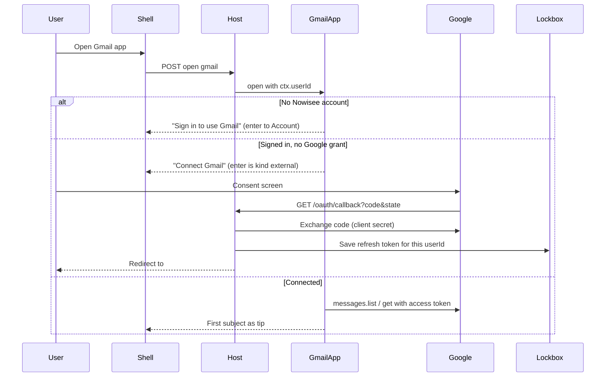

# Gmail — Google OAuth and API research

Product graph and v1 behavior: [`README.md`](README.md). Identity/lockbox: [`docs/IDENTITY.md`](../../../docs/IDENTITY.md) §3.

This file is the feasibility research that led to that slice (console setup, restricted scopes, quota, verification). It is not an implementation ticket.

---

**Verdict:** Talking to Gmail from Nowisee works. Apps run on the server, the browser never calls Google, tokens live in the host lockbox, and signed-out (or unconnected) is an ordinary node. Nothing in core needs a Gmail special case.

What is *not* free or automatic is **Google’s OAuth program**: reading mail requires **restricted** scopes, which caps you at 100 test users until you complete verification (and a security assessment if you store mail on the server — which we must, because tokens and message bodies never belong in the page).

The slice consumes the host **lockbox** and **OAuth broker**. Distinguish two secret kinds; they are different slots:

| Secret | What it is | Who it belongs to |
|--------|------------|-------------------|
| Google **client id + client secret** | The “app key” from Google Cloud | One pair for the whole Gmail app; host secrets, never the page |
| Per-user **refresh token** | Proof that *this* Nowisee user connected *this* Google account | Lockbox keyed `(userId, appId, slot)` |

---

## 1. How you get the Google “app key”

There is no Gmail API key that can read someone’s inbox. User mail is **OAuth 2.0**. The credentials you create are an **OAuth client ID** (public) and **client secret** (confidential). A Google Cloud **API key** cannot do this job.

### Console steps (do once per environment)

1. In [Google Cloud Console](https://console.cloud.google.com/) create a project (e.g. `nowisee-gmail-dev`). Keep a **separate** project for production; Google recommends that and verification is per project.
2. Enable **Gmail API** (APIs & Services → Library).
3. Configure the **OAuth consent screen**:
   - User type **External** (unless you only serve one Google Workspace org — then **Internal** and verification is skipped).
   - App name, support email, developer contact.
   - For testing you can skip homepage / privacy policy. For a public launch Google requires a public homepage and a privacy policy on the same domain that states you read/send mail, what you store, and that you delete on disconnect.
4. Add scopes (see §3). They will show as **Restricted** for read/modify.
5. **Audience → Testing**, add up to **100 test Google accounts**. Only those accounts can connect. They will see a “Google hasn’t verified this app” screen; they click Advanced → Go to Nowisee.
6. Credentials → **Create credentials → OAuth client ID → Web application** (not Desktop, not API key, not service account).
   - Authorized JavaScript origins: `http://localhost:5173` (dev), later `https://your-origin`.
   - Authorized redirect URIs: a **real HTTP path**, not a hash. The host callback is **`GET /oauth/callback`** for every app (dispatch by `state`). Example: `http://localhost:5173/oauth/callback` and later `https://your-origin/oauth/callback`.
7. Copy client ID + secret into the host secrets store (or env, see options below). Never commit them. Never send them to the client bundle.

**Service accounts cannot open consumer Gmail.** Domain-wide delegation is Workspace-admin only. Ignore that path.

**Localhost is allowed** as a redirect URI without domain verification. Production needs HTTPS and a verified domain.

---

## 2. Two logins, not one

Nowisee identity and Google identity stay separate. Core still knows nothing about “signed in.”

**Required order:** Nowisee session first (`ctx.userId`), then Google connect. The lockbox cannot store a token against `null`. Reuse the existing `signedOut()` helper from app-kit for the Nowisee-signed-out case. The “Connect Gmail” node is a **different** node: enter is `kind: "external"` to Google’s authorize URL, not an `app` edge to Account.

Navigator already leaves the product on `kind: "external"`. That is the correct way to send someone to Google. Apps still must not build `#/…` URLs.

### OAuth callback is the one new host HTTP surface

Google redirects with **GET + query string**. `/api` stays POST + JSON + Origin. The OAuth callback is a **separate** GET: `GET /oauth/callback`. CSRF for this GET is the OAuth `state` nonce (bound to `sessionId` + `userId` in `oauth_states`, 10-minute TTL), not the JSON Origin check. Do **not** run `checkCsrf` on this GET.

The session cookie is `SameSite=Lax`, so it **is** sent on this top-level GET. That is what lets the host know which Nowisee user just returned.

After exchanging the code, the host stores the refresh token in the lockbox and **302-redirects** to the SPA hash (e.g. `/#/gmail`). Then `open` runs as usual and the inbox is the tip.

**Option A (landed): generic host OAuth broker.** Host owns `GET /oauth/callback` (one path for every app; dispatch by `state`). Gmail (and later any OAuth app) is granted `ctx.oauth` / uses host env for that app’s client id/secret. The host does not parse Gmail messages. This matches “host owns HTTP; apps own domain.” Do not add `/oauth/gmail/callback`.

**Option B: Gmail-specific route in the host.** Faster to ship, worse: the host grows a product name. Avoid unless you explicitly want a one-off.

**Option C: OAuth 2 device code grant.** Stay inside Nowisee: show “Go to google.com/device and enter ABCD-EFGH.” No redirect URI. Google may not enable device flow for a Web client; confirm before betting on it. Better as an *accessibility extra* than as the only path.

Always request `access_type=offline` and `prompt=consent` on first connect so Google actually returns a **refresh token**. Store it immediately; Google often sends it only once.

**Testing gotcha:** while the consent screen is in **Testing**, Google refresh tokens **expire after 7 days**. Reconnect weekly until the app is published/verified.

---

## 3. Scopes (this is the main feasibility gate)

From Google’s current Gmail scope table:

- `gmail.send` — **Sensitive** only (send, cannot read inbox).
- `gmail.readonly`, `gmail.compose`, `gmail.modify`, `mail.google.com` — **Restricted**.

An inbox you can read **requires a restricted scope**. There is no non-restricted way to fetch subjects/bodies.

**Option 1 — least privilege for a first slice:** `gmail.readonly` + `gmail.send`. Read inbox + send/reply. Cannot mark read, archive, or trash.

**Option 2 — one scope that matches a real mail client:** `gmail.modify` only. Read, send, labels, trash (not skip-trash permanent delete). Simplest to request; still restricted.

**Option 3 — `mail.google.com`:** IMAP-level, including permanent delete. Triggers the heaviest review. Do not start here.

Do **not** use IMAP/SMTP + app passwords. App passwords are a worse a11y flow, and IMAP still wants the most restricted scope if you use XOAUTH2.

### Who can use it, and what verification costs

| Audience | What Google requires | Cost / time |
|----------|----------------------|-------------|
| You + named testers (≤100 Google accounts) | Testing audience, no verification | **$0**. Unverified-app warning. 7-day refresh tokens. |
| Internal Google Workspace only | User type Internal | **$0**, no restricted-scope review. |
| Any Gmail user, public | Brand verification + restricted-scope review. Because the **server** holds tokens and mail: **annual CASA / App Defense Alliance security assessment**. Also: homepage, privacy policy, unlisted demo video of the OAuth + inbox flow, Search Console domain verify. | Google brand review: free, days. Restricted review: weeks. CASA: **paid, billed by a Google-empanelled lab** (third-party quotes currently range from roughly hundreds/year on self-serve CASA tracks to much more on legacy manual tracks — **confirm with the lab at submission**; do not budget from blog posts). Recertify **every 12 months**. |
| Stay under 100 forever | Personal-use exception | **$0**, but you cannot onboard strangers. |

Gmail restricted scopes are only allowed for certain app types (email client, backup, etc.). An accessibility mail reader/composer is an email client; say that in the justification. You must also follow Google’s **Limited Use** rules: no ads from mail content, no selling the data, delete user data on disconnect/account deletion.

**Option for skipping Google verification entirely:** a paid aggregator (Nylas, Unipile, etc.). They already have verified Gmail apps; you pay **per connected mailbox / month**. Makes sense only if public launch + CASA is the blocker. You would still talk to *their* API from the Gmail app server, never from the browser.

---

## 4. Talking to Gmail — will it work, and what does it cost?

**Yes.** The Gmail REST API is the right backend. The app (server) calls `https://gmail.googleapis.com/gmail/v1/users/me/...` with a Bearer access token minted from the lockbox refresh token.

Keep **zero runtime npm dependencies** for the HTTP client: use Node `fetch`, not `googleapis`. Parse JSON. This matches the rest of the repo (zero runtime npm dependencies).

Suggested first calls:

- `users.getProfile` — email address for “Connected as …”.
- `users.messages.list?labelIds=INBOX&maxResults=20` — ids (5 quota units).
- `users.messages.get?format=metadata&metadataHeaders=From,Subject,Date` — subject lines (20 units each).
- `users.messages.get?format=full` — body when the user enters a message (20 units).
- `users.messages.send` — send (100 units).
- Later: `users.history.list` (2 units) using a stored `historyId` so you do not re-download the mailbox every Down key.

**Quota (current Google docs):**

- 1,200,000 units/min/project; **6,000 units/min/user**.
- Daily “no extra charge” threshold: **80,000,000 units/project**. Google has said usage **under** that stays free; exceeding it is **planned to bill later in 2026** with ≥90 days notice. Interactive use for a small user base will not approach this.
- Backoff on 429. Do not retry action sends blindly (locked: core never retries `extras.action`; the app should not either).
- Separate **sending** caps (Gmail product, not API units): **500/day** consumer, **2000/day** Workspace.

**Google Cloud bill:** Gmail API calls themselves are **$0** at normal volume. A Cloud project is free. You do **not** need a billing account just to enable Gmail API. **Pub/Sub** (only if you add push `users.watch`) has a free tier, then small charges; skip it for v1.

**Nowisee cost:** same Node host you already run. Extra SQLite file `data/apps/gmail.db` for cache + short-lived OAuth `state` (not tokens). Bandwidth is Gmail JSON, not huge.

---

## 5. Architecture fit (do not put Gmail in core)

See [`README.md`](README.md) for where graph, REST, store, and tokens live.

**Owner in every Gmail query:** treat Google message ids on the stack as untrusted. Always: this `userId`’s token → `users/me`. Never “fetch message X” without going through the connected account.

**Do not** put SMTP in core, a mail repository in core, or a 401/redirect in the shell.

**1 MiB `/api` cap:** never put a whole HTML MIME blob in `warm`. Subjects + a neighborhood of body chunks only.

**`requestRefresh`:** v1 shipped without it (new mail appears on the next intent). The reserved platform capability is still the right seam before a tip must update with no user action — [`docs/PREPAREDNESS.md`](../../../docs/PREPAREDNESS.md).

---

## 6. Gotchas that remain true

- **Connect leaves Nowisee** for Google’s UI. Device-code is an in-product alternative only if Google allows it for this client type.
- **7-day test tokens / revocation:** `invalid_grant` → Connect node again.
- **Privacy / logs:** never log `/api` bodies, tokens, or Gmail get payloads.
- **Account deletion** is still deferred in [`docs/IDENTITY.md`](../../../docs/IDENTITY.md) §13; when it exists, Gmail must revoke + delete cache + lockbox slot.
- **Bodies:** `splitText` in app-kit; prefer `text/plain`; conservative HTML strip. Do not put whole MIME blobs in `warm`.
- **Push mail (`users.watch` + Pub/Sub):** needs `requestRefresh`. Not in v1.
- **Going public:** privacy policy, homepage, demo video, domain verify, restricted-scope review, annual CASA. Testing audience (≤100) stays $0.

Product graph (what v1 actually shipped): [`README.md`](README.md).
